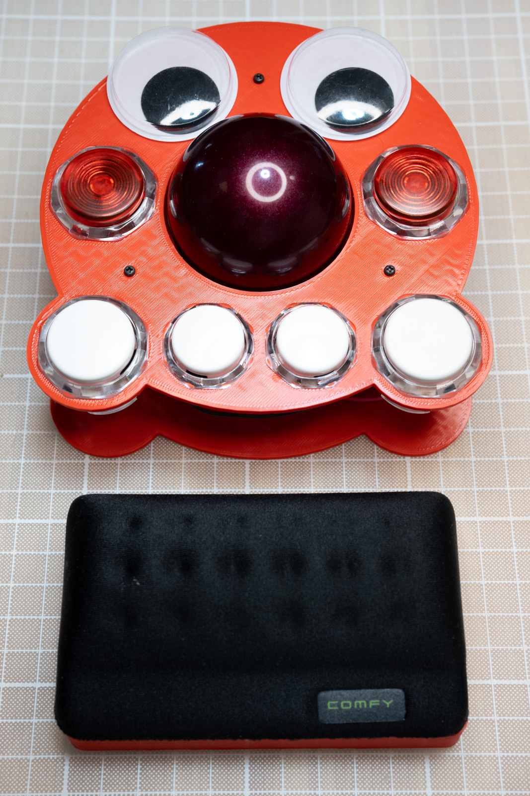

# tako

**tako** は 55 mm トラックボール、PMW3360 センサー、RP2040‏-Zero MCU、そして大径 624ZZ ベアリングによる 3 点支持構造を特徴とする 6 ボタン仕様の自作トラックボールです。
アーケード用スイッチを用いた高いクリック感と、CPI 切り替えによる精密なポインタ操作を実現します。

 <!-- 任意: 実機写真があれば -->

---

## 🔧 特徴

* ボール: **55 mm径ボール**（PERIPRO-304など）
* 光学センサー: **PMW3360**（SPI）
* マイコン: **RP2040-Zero**（USB-C）
* 支持機構: **624ZZ ベアリング x3**
* ボタン: アーケード用スイッチ（30mm×4, 24mm×2）
* ファームウェア: **QMK Firmware** ベース
* CPI 切り替え可能（600 ↔ 200 CPI）
* ドラッグスクロール対応

---

## 📦 含まれるもの

* `firmware/`: QMK ファームウェアソースおよびビルド済み `.uf2`
* `case/`: 3D プリント用 STL ファイル
* `docs/build_guide.md`: ビルドガイド（日本語）

---

## 📘 ビルドガイド

👉 [ビルドガイドはこちら](docs/build_guide.md)

---

## 🧑‍💻 ファームウェア書き込み（簡易手順）

1. RP2040-Zero の **BOOT** ボタンを押しながら USB 接続
2. 表示される `RPI-RP2` ドライブに `.uf2` ファイルをコピー
3. 自動で再起動し、USB HID デバイスとして認識されたら完了

---

## 📜 ライセンス

MIT License
Copyright © 2025 shiiba
