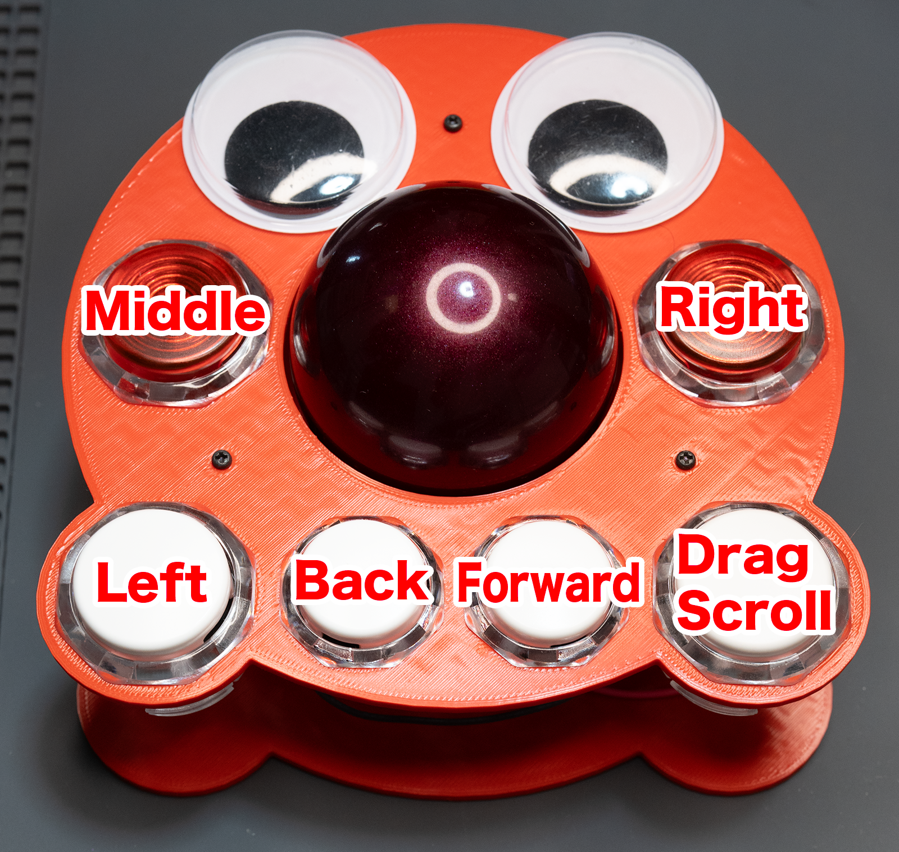

# tako ビルドガイド

---

## 目次

1. [仕様概要](#1-仕様概要)
2. [必要なもの](#2-必要なもの)
3. [3D プリント設定](#3-3d-プリント設定)
4. [配線図](#4-配線図)
5. [組立手順](#5-組立手順)
6. [ファームウェア書き込み](#6-ファームウェア書き込み)
7. [動作確認](#7-動作確認)
8. [参考・謝辞](#8-参考・謝辞)
9. [ライセンス & コピーライト](#9-ライセンス--コピーライト)

---

## 1. 仕様概要

| 項目       | 内容                                               |
| ---------- | -------------------------------------------------- |
| ボール径   | **55 mm**                                          |
| センサー   | **PMW3360**（SPI 接続）                            |
| MCU        | **RP2040‑Zero**（USB‑C）                           |
| ベアリング | **624ZZ** × 3（内径 4 mm / 外径 13 mm / 幅 5 mm） |
| ボタン     | 6 ボタン (⌀30 mm × 4、⌀24 mm × 2)                 |
| ケース     | 3D プリント（STL 同梱）                            |

---

## 2. 必要なもの
ブレイクアウト基板と3D プリント部品を除き、すべて市販品で構成されています。

### 2‑1. 電子部品

| 区分                   | 品名／型番                 | 個数 | 備考                                                                                       |
| ---------------------- | -------------------------- | ---- | ------------------------------------------------------------------------------------------ |
| **センサー**           | **PMW3360 本体**           | 1    | —                                                                                          |
| **ブレイクアウト基板** | **PMW3360 breakout board** | 1    | [https://github.com/jfedor2/pmw3360-breakout](https://github.com/jfedor2/pmw3360-breakout) |
| **MCU**                | **RP2040‑Zero**           | 1    | USB‑C                                                                                     |

### 2‑2. 機構部品

| 区分                      | 品名                          | 個数 | 備考                                             |
| ------------------------- | ----------------------------- | ---- | ------------------------------------------------ |
| **ベアリング**            | **624ZZ**                     | 3    | —                                                |
| **ボタン (⌀30 mm)**       | はめ込み式ゲームスイッチ      | 4    | 例: GamerFinger NEW‑HBFS‑30                      |
| **ボタン (⌀24 mm)**       | はめ込み式ゲームスイッチ      | 2    | 例: GamerFinger NEW‑HBFS‑24                      |
| **ボール**                | **55 mm**                     | 1    | 例: PERIXX PERIPRO‑304                           |
| **ネジ**                  | M2×4                         | 4    | ブレイクアウト基板固定                           |
| 〃                        | M2×6                         | 7    | センサーカバー 4、本体 3                         |
| **3D プリント部品 (STL)** | `tako_bearingshaft_624ZZ.stl` | 3    | ベアリングシャフト                               |
|                           | `tako_bottom_624ZZ.stl`       | 1    | ボトムケース                                     |
|                           | `tako_sensorcover.stl`        | 1    | センサーカバー                                   |
|                           | `tako_top_624ZZ.stl`          | 1    | トップケース                                     |
|                           | `tako_wristrest_15mm.stl`     | 1    | （任意）リストレスト台座                         |
| **リストレスト (任意)**   | ELECOM COMFY MOH‑013BK        | 1    | —                                                |
| **両面テープ (任意)**     | —                             | 適量 | リストレスト固定用                               |
| **滑り止めパッド (任意)** | —                             | 適量 | 本体およびリストレスト台座の底面貼付・傾斜調整用 |
| **目玉シール (任意)**     | 30–40 mm                      | 2    | トップケース装飾用                               |

### 2‑3. コネクタ／ハウジング／ケーブル

| 区分                      | 型番                                      | 個数    | 用途                 |
| ------------------------- | ----------------------------------------- | ------- | -------------------- |
| **コンタクトピン**        | **QI2550 圧着端子**                       | 15 以上 | 予備を含め多めに準備 |
| **ハウジング 1P**         | **QI2550 1P**                             | 5       | GND, 3V3 など        |
| **ハウジング 3P**         | **QI2550 3P**                             | 2       | 各ボタン → MCU      |
| **ハウジング 4P**         | **QI2550 4P**                             | 1       | センサー → MCU      |
| **ピンヘッダー**          | **1×3 (2.54 mm)**                        | 1       | GND 共通化用         |
| **圧着端子**              | **Faston #110 (L型 / 絶縁ケース付 推奨)** | 12 以上 | ボタンスイッチ接続   |
| **ケーブル**              | **AWG24 配線**                            | 適量    | —                    |
| **絶縁テープ**            | —                                         | 適量    | ピンヘッダー保護     |
| **熱収縮チューブ (任意)** | —                                         | 適量    | ケーブル保護・束線用 |

### 2‑4. 工具

| 区分     | 名称                  | 用途                           |
| -------- | --------------------- | ------------------------------ |
| 造形     | **3D プリンタ (FDM)** | ケース・ベアリングシャフト造形 |
| 基板実装 | 半田ごて + はんだ     | センサー・ヘッダー実装         |
| 配線加工 | ニッパー              | ケーブル長調整                 |
| 圧着     | Faston 圧着工具       | ボタン用 Faston #110           |
| 〃       | QI2550 圧着工具       | コネクタ結線                   |
| 仕上げ   | プラスドライバー      | M2 ネジ締結                    |

---

## 3. 3D プリント設定

| パーツ | 素材 | レイヤー高 | インフィル   |
| ------ | ---- | ---------- | ------------ |
| すべて | PLA  | 0.20 mm    | 15 % グリッド |

---

## 4. 配線図

### 4‑1. センサー

| PMW3360 | RP2040‑Zero  |
| ------- | ------------ |
| SCLK    | GPIO2        |
| MOSI    | GPIO3        |
| MISO    | GPIO4        |
| NCS     | GPIO5        |
| 3V3     | 3V3 OUT      |
| GND     | GND          |

### 4‑2. ボタン割り当て（デフォルト）

| ボタン             | RP2040‑Zero GPIO |
| ------------------ | ---------------- |
| 左クリック         | GPIO14           |
| 右クリック         | GPIO27           |
| 中クリック         | GPIO15           |
| 戻る               | GPIO26           |
| 進む               | GPIO29           |
| ドラッグスクロール | GPIO28           |

### 4‑3. CPI 設定と切り替え

* **初期 CPI**: 600
* **切り替え操作**: ドラッグスクロールボタン(GPIO28)を押しながら左クリック(GPIO14)を押すと、**CPI が 600 ↔ 200 に切り替わります**。

---

## 5. 組立手順

1. **ブレイクアウト基板の準備**  
   **PMW3360** をブレイクアウト基板へ実装し、各ピンにリード線をはんだ付けします。  
     
   
2. **GND 共通化用ピンヘッダーの準備**  
   ボタン GND をまとめるために **1×3 ピンヘッダー (2.54 mm)** をハンダブリッジして 3 ピンを共通化した "GND バス" を自作します。
   ブリッジ部は **絶縁テープ** を巻いてショートを防止します。  
   
3. **ボトムケースへのセンサー固定**  
   ブレイクアウト基板を `tako_bottom_624ZZ.stl` に収め、M2×4 ネジ×4 で固定。  
   
4. **レンズ & センサーカバー**  
   レンズを装着後、`tako_sensorcover.stl` を被せて M2×6 ネジ×4 で固定。  
     
   
5. **ベアリングユニット作成**  
   **624ZZ** に `tako_bearingshaft_624ZZ.stl` を差し込み、3 つ用意。  
   
6. **支持ベアリング取付**  
   ユニットをボトムケースへ押し込み固定。  
   
7. **MCU 取付 & 配線**  
   **RP2040‑Zero** を所定位置に差込み、センサー配線を **QI2550** コネクタ経由で接続します。  
   必要に応じて配線を束ね **熱収縮チューブ** に通し軽く炙ることで配線を整理します。  
   
8. **トップケースにボタン実装**  
   ⌀30 mm ×4、⌀24 mm ×2 をはめ込み。  
   
9. **ボタンの圧着・結線**  
   **Faston #110** 端子を圧着し、ボタンタブへ接続します。
   圧着後は端子全体を **絶縁ケース（熱収縮チューブや樹脂カバー）** で保護し、金属露出部がないことを確認します。  
   ケーブルは **QI2550 3P** ハウジングにまとめ、対応する MCU の GPIO へ接続してください。  
   必要に応じて配線を束ね **熱収縮チューブ** に通し軽く炙ることで配線を整理します。  
     
   
10. **ケース合体**  
    トップケースを被せ、M2×6 ネジ×3 で固定。  
    好みに合わせて 30–40 mm の目玉シールを貼り付け。  
    
11. **滑り止めパッド貼付 (任意)**  
    底面に滑り止めパッドを貼り付け、前傾・後傾など微調整。  
    
12. **リストレスト貼付 (任意)**  
    台座の上にリストレストを載せ、両面テープで固定。  
    底面に滑り止めパッドを貼り付け。  
      
    
13. **完成**  
    これで完成です。お疲れ様でした。  
    

---

## 6. ファームウェア書き込み

1. **RP2040‑Zero** の **BOOT** ボタンを押しながら PC に **USB** 接続。
2. マウントされた **RPI‑RP2** ドライブへ `.uf2` ファイルをコピー。
3. 自動で再起動し、**USB HID デバイス**として認識されたら完了。

---

## 7. 動作確認

1. **55 mm** ボールを載せてスムーズに回転するか確認。
2. ポインタ操作や各ボタンの反応を確認。
3. ドラッグスクロールボタンを押しながらボールを動かしてスクロール確認。
4. ドラッグスクロールボタン＋左クリックで CPI が切り替わるか確認。

---

## 8. 参考・謝辞

* **PMW3360 Breakout Board** © jfedor2
* **QMK Firmware** © QMK Community
* 各種ライブラリ作者の皆様に感謝します。

---

## 9. ライセンス & コピーライト

本ガイドおよび付属 **STL／QMK キーマップ** は、**MIT ライセンス**で配布します。
ご自由に改変・再配布いただけますが、著作権表示の保持をお願いします。

**Copyright © 2025 shiiba**
